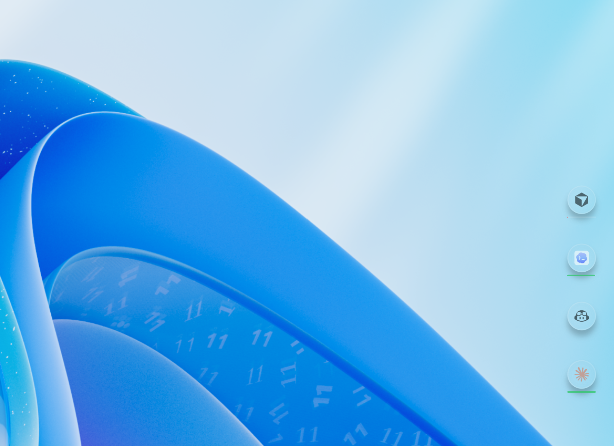

<p align="center">
  
</p>

<h1 align="center">Agent Pulse</h1>

<p align="center"><em>Ambient, glanceable awareness of AI coding agents.</em></p>

<p align="center">
  <a href="https://github.com/Dipen-Dedania/agent-pulse/actions/workflows/ci.yml"></a>
  <a href="https://github.com/Dipen-Dedania/agent-pulse/releases/latest"></a>
  <a href="LICENSE.md"></a>
  
  [](https://github.com/sponsors/Dipen-Dedania)
  

</p>

Agent Pulse is a cross-platform Electron desktop app that surfaces the state of every AI coding agent on your machine through floating, always-on-top status bubbles. Instead of tab-hopping between Claude Code, Cursor, Codex, Copilot, Kiro, and Antigravity to check whether an agent is still working, idle, or has crashed, you see it at a glance in a frosted-glass bubble — anywhere on your desktop.

It also bundles a unified status bridge, subscription usage meters for Claude / Codex / Cursor / Antigravity, a local Pulse Timeline with estimated-cost analytics, a configurable Claude Code status line, Discord/Slack attention webhooks, a cowork session scheduler, and a configurable shell-command guardrail engine.

<p align="center">
  
</p>

<p align="center">
  <video src="https://github.com/Dipen-Dedania/agent-pulse/raw/main/brag-output/brag.mp4" controls width="720" muted></video>
</p>

<p align="center"><sub>▶️ <a href="https://github.com/Dipen-Dedania/agent-pulse/raw/main/brag-output/brag.mp4">Watch the demo</a> if the video doesn't play inline.</sub></p>

<p align="center">
  <a href="https://dipen-dedania.github.io/agent-pulse/">Website</a> ·
  <a href="https://github.com/Dipen-Dedania/agent-pulse/releases/latest">Download</a> ·
  <a href="CONTRIBUTING.md">Contributing</a> ·
  <a href="SECURITY.md">Security</a>
</p>

---

## Download

Grab the latest installer from the **[Releases page](https://github.com/Dipen-Dedania/agent-pulse/releases/latest)**:

| Platform | File |
| --- | --- |
| Windows | `Agent-Pulse-Setup-<version>.exe` (NSIS) |
| macOS   | `Agent-Pulse-<version>.dmg` (arm64 + x64) |
| Linux   | `Agent-Pulse-<version>.AppImage` |

In-progress builds for any commit on `main` are also available as workflow artifacts on the [Actions tab](https://github.com/Dipen-Dedania/agent-pulse/actions/workflows/release.yml).

---

## Highlights

### Ambient status bubbles
- Always-on-top, draggable, per-tool bubbles with an Apple Glass (glassmorphism) look.
- Animated state indicators powered by Framer Motion:
  - **Working** — soft pulsing glow with orbiting particles.
  - **Waiting** — agent is awaiting your input.
  - **Idle / Idle-active** — calm breathing effect.
  - **Error / Dead** — red glow plus a shake.
- Toggle each bubble independently from Settings; the layout persists across restarts.

### Unified status bridge
- Local HTTP server on `http://localhost:4242/event` that ingests lifecycle events from every supported tool.
- Normalizes vendor-specific event names (`PreToolUse`, `Stop`, `agentSpawn`, etc.) into a single `AgentState` schema (`src/common/types.ts`).
- One-click hook install/uninstall per tool from the Settings panel.

### Supported tools
| Tool | Surface | Hook mechanism |
| --- | --- | --- |
| Claude Code | CLI | HTTP hook (`~/.claude/settings.json`) |
| Cursor | IDE | Shell hook (`~/.cursor/hooks.json`) |
| GitHub Copilot (VS Code) | IDE | Shell hook (`.github/hooks/agent-pulse-hooks.json`) |
| OpenAI Codex | CLI | Shell hook (`~/.codex/hooks.json`) |
| Kiro | IDE | Shell hook (`.kiro/hooks/agent-pulse.kiro.hook`) |
| Antigravity | **CLI + IDE** | Shell hook (`~/.gemini/config/hooks.json`) — one install covers both surfaces |

Want a tool that isn't listed? Open a [tool support request](https://github.com/Dipen-Dedania/agent-pulse/issues/new?template=tool_support_request.yml) — or better, [add it yourself](CONTRIBUTING.md#adding-support-for-a-new-tool).

### Subscription usage tracking
- **Claude Code** — polls Anthropic's OAuth usage endpoint for the 5-hour and 7-day windows.
- **OpenAI Codex** — polls ChatGPT's `/backend-api/wham/usage` for primary (and optional secondary) windows.
- **Cursor** — polls `cursor.com/api/usage-summary` for the billing-cycle window (utilization %, reset time, plan), authenticated via a session cookie built from Cursor's local `state.vscdb`.
- **Antigravity** — polls the IDE's local gRPC-Web endpoint for per-model quotas while the IDE is running.
- Configurable cap-warning ("you're about to hit your limit") and nudge ("use it or lose it before reset") notifications.

### Command guardrails
- Block or warn on risky shell commands before they reach an agent (e.g. `rm -rf /`, `git push --force` to protected branches).
- Built-in core rule set plus user-defined custom rules with validated regex.
- Live event log of triggered guardrails in the Settings panel.

### Pulse Timeline (Analytics tab)
- Local SQLite database (`<userData>/pulse-timeline.db`) persists every normalized event, derived session, and quota snapshot.
- **Daily digest** — today + yesterday active time, sessions, top tasks, tokens, and quota burned per tool.
- **Activity heatmap** — GitHub-contrib-style grid over 30 or 90 days, grouped by tool, project, or combined. Project tracking walks up to the nearest `.git` root from each hook's `cwd`.
- **Hour-of-day rhythm** — 24-bucket histogram of when you actually pair with agents.
- **Tool mix** — share of active time per tool over 7 or 30 days.
- **Model usage** — token + session breakdown per model. v1 captures Claude Code via transcript tailing; other tools' coverage depends on whether their hooks expose a model field.
- **Estimated cost** — digest, model-usage, tool-mix, and token-timeline cards can switch to a cost view. These are **estimated API list prices only** (input / output / cache-write / cache-read), never real subscription billing. Prices come from a live LiteLLM table cached locally and refreshed daily (offline-safe; falls back to a bundled table). Models without a known price are flagged "unpriced".
- **Project breakdown** — ranked list of `.git` roots by total active time, with the agents that touched each.
- Fully local; no telemetry. Privacy toggle redacts task summaries from storage. Idle-gap is configurable. 60-day retention on events and quota samples; sessions kept forever (~300 KB / 30 days).
- Requires the native module `better-sqlite3`. Run `npm run rebuild:native` after install. If the rebuild fails, the rest of the app keeps working — the timeline simply records nothing until you rebuild.

### Claude Code status line
- Configurable status line rendered by Claude Code at the bottom of each turn, installed into `~/.claude/settings.json` with one click.
- Segment-based: pick from model name, context-usage bar, cwd, project dir, git branch, repo, session cost, duration, lines changed, 5-hour / 7-day rate-limit windows, output style, effort level, vim mode, and PR number.
- A single reference renderer (`src/common/statusline-render.ts`) is exported to a Node/Python/PowerShell script so the line stays consistent across shells; layout, separators, colors, and per-line wrapping are configurable in Settings.
- Detects and backs up an existing status line before replacing it.

### Attention webhooks (Discord / Slack)
- An attention engine watches each tool; when an agent sits in the **Waiting** state past a configurable threshold, it escalates once per waiting episode.
- Escalation can intensify the bubble badge, raise an OS notification, and POST to one or more **Discord** and/or **Slack** webhooks (Discord embeds / Slack mrkdwn) with the tool name, task summary, and idle duration.
- Per-webhook enable toggles and a "send test" button to validate a URL before relying on it.

### Cowork scheduler
- Optionally keeps Claude Code's 5-hour windows warm by firing minimal `claude -p` opener pings on a schedule, so a fresh window is ready when you start work.
- **Fixed** mode (explicit time + weekday slots) or **adaptive** mode (one opener per window reset inside your work hours), with a per-day opener cap.
- Optional token-refresh nudge fires shortly before the OAuth token expires when no opener is otherwise due. Openers are tiny (~a fraction of a cent each).

### Desktop integration
- **Single-instance** — launching the app a second time focuses the running instance instead of spawning a duplicate (which would also collide on the bridge port).
- **Launch on startup** — toggle in Settings; works on Windows (login items), macOS (login items, launched hidden), and Linux (`~/.config/autostart/agent-pulse.desktop`).
- **Tray-resident** — the app keeps living after the last window closes; quit from the tray menu.

---

## Quick start

### Prerequisites
- [Node.js](https://nodejs.org/) v22+ (required by `@electron/rebuild` and for `better-sqlite3` prebuilt binaries)
- npm (ships with Node.js)

### Install & run in dev
```bash
git clone https://github.com/Dipen-Dedania/agent-pulse.git
cd agent-pulse
npm install
npm run rebuild:native   # rebuild better-sqlite3 for Electron (needed by Pulse Timeline)
npm start
```
This launches the Vite renderer and the Electron main process together.

### Package a production build
```bash
npm run dist:win     # NSIS installer for Windows x64
npm run dist:mac     # DMG for macOS (arm64 + x64)
npm run dist:linux   # AppImage for Linux
npm run dist:all     # All three (use sparingly — slow)
```
Output lands in `release/`.

Maintainers: see [docs/RELEASING.md](docs/RELEASING.md) for the release process and update-feed operations.

---

## Auto-updates

Agent Pulse ships with an in-app updater that quietly keeps every installed copy on the latest build. It checks shortly after launch and every 6 hours after that; downloads are **never automatic** — you click **Download**, then **Restart & install** when ready. Windows auto-updates end-to-end; macOS currently shows a manual-install banner (code signing isn't wired yet).

How the feed works, how releases are cut, and how to debug an update check live in [docs/RELEASING.md](docs/RELEASING.md).

---

## npm scripts

| Script | What it does | When to use |
| --- | --- | --- |
| `npm start` | Runs Vite + Electron concurrently via `concurrently` and `wait-on`. | Day-to-day development. |
| `npm run start:info` | `npm start` with `AGENT_PULSE_LOG_LEVEL=info`. | More verbose main-process logs. |
| `npm run start:warn` | `npm start` with `AGENT_PULSE_LOG_LEVEL=warn`. | Quieter logs. |
| `npm run start:error` | `npm start` with `AGENT_PULSE_LOG_LEVEL=error`. | Errors only. |
| `npm run dev:renderer` | Vite dev server only (port 5173). | Pure UI iteration without the Electron main process. |
| `npm run dev:main` | Builds the main process and launches Electron against the running Vite server. | When the renderer is already running elsewhere. |
| `npm run build:main` | Compiles the Electron main process (`tsc -p tsconfig.main.json`). | Pre-flight for packaging or main-process type checks. |
| `npm run build:renderer` | Builds the React renderer with Vite. | Production renderer bundle. |
| `npm run build` | Runs `build:main` then `build:renderer`. | Full production build before packaging. |
| `npm run test:bridge` | Sends simulated hook events through the bridge without the GUI. | Smoke-test bridge normalization. |
| `npm test` | Runs the Vitest suite once. | CI and pre-commit. |
| `npm run test:watch` | Vitest in watch mode. | TDD loop. |
| `npm run test:coverage` | Vitest with V8 coverage. | Coverage reports under `coverage/`. |
| `npm run pack` | `npm run build` + `electron-builder --dir` (unpacked). | Fast local sanity-check of the packaged app. |
| `npm run dist` | `npm run build` + `electron-builder`. | Build installers for the current platform. |
| `npm run dist:win` / `dist:mac` / `dist:linux` | Targeted installer builds with `--publish never`. | Cut a single-platform artifact. |
| `npm run dist:all` | All three platforms (`-mwl`). | Multi-OS release. |
| `npm run rebuild:native` | Rebuild `better-sqlite3` against the current Electron ABI. | After `npm install`, or whenever Pulse Timeline logs `better-sqlite3 not loadable`. |

---

## Architecture

```
┌─────────────────────────────────────────────────────────────┐
│                  Agent Pulse (Electron app)                 │
│                                                             │
│   ┌──────────────┐                  ┌──────────────────┐    │
│   │  Main proc   │  ── IPC ──▶      │   Renderer       │    │
│   │              │                  │  (React + Vite)  │    │
│   │  • Bridge    │ ◀── IPC ──       │                  │    │
│   │  • Installer │                  │  • Bubbles       │    │
│   │  • Pollers   │                  │  • Settings      │    │
│   │  • Tray      │                  │                  │    │
│   └──────┬───────┘                  └──────────────────┘    │
└──────────┼──────────────────────────────────────────────────┘
           │ HTTP POST  (localhost:4242/event)
           │
┌──────────┴───────────────────────────────────────────────────┐
│   Tool hooks: Claude Code · Cursor · Copilot · Codex ·       │
│               Kiro · Antigravity (CLI + IDE)                 │
└──────────────────────────────────────────────────────────────┘
```

- **Main process** (`src/main/`) owns the HTTP bridge, tool detection, hook writing, usage pollers, guardrail engine, and window/tray management.
- **Renderer** (`src/renderer/`) is a React 19 + Tailwind CSS 4 SPA. It renders both bubbles and the Settings window using URL params (`?view=settings`, `?toolId=<id>`).
- **Bridge** (`src/main/bridge/`) listens on port `4242`, normalizes events, and pushes the resulting state to all renderer windows via IPC.
- **Common** (`src/common/`) holds the shared event schema, tool metadata, logger, and guardrail types used by both processes.

## Project structure

```
src/
├── common/            # Shared types, logger, tool metadata, guardrails schema
├── main/
│   ├── bridge/        # HTTP server + state manager
│   ├── installer/     # Tool detection + hook config writers
│   ├── usage/         # Claude usage poller
│   ├── codex-usage/   # Codex usage poller
│   ├── cursor-usage/  # Cursor usage poller
│   ├── antigravity-usage/  # Antigravity IDE usage poller
│   ├── llm-pricing/   # LiteLLM price-table poller (estimated-cost analytics)
│   ├── timeline/      # SQLite Pulse Timeline store + writers
│   ├── attention/     # Waiting-state escalation engine
│   ├── notifications/ # Discord/Slack webhook senders
│   ├── scheduler/     # Cowork session opener scheduler
│   ├── guardrails/    # Core rules + regex safety engine
│   ├── windows/       # Bubble/Settings BrowserWindow + tray + preload
│   ├── auto-launch.ts # Cross-OS login-item / autostart integration
│   ├── user-config.ts # Persisted UserConfig in ~/.claude/agent-pulse-config.json
│   └── index.ts       # App entry: single-instance lock, IPC wiring
└── renderer/
    ├── components/Bubble/    # Animated status bubbles
    ├── components/Settings/  # Hooks, Usage, Guardrails tabs
    ├── hooks/                # React hooks
    └── store/                # Zustand store
```

## Testing

Run the full Vitest suite:
```bash
npm test
```

What's covered:
- **Bridge event normalization** — all supported tools × every hook event → correct `AgentState`.
- **Bubble animations** — every tool × every state renders the right Framer Motion variant.
- **Zustand status store** — state updates, multi-tool independence, initial hydration.
- **Hook installer** — `installHook` / `uninstallHook` round-trip for each tool.
- **Guardrail engine** — pattern matching and regex safety validation.

For a quick end-to-end check without launching the GUI:
```bash
npm run test:bridge
```

---

## Config files Agent Pulse touches

| Path | Purpose |
| --- | --- |
| `~/.claude/agent-pulse-config.json` | Persisted user settings (enabled bubbles, usage, guardrails, status line, attention webhooks, scheduler, auto-launch). |
| `~/.claude/settings.json` | Claude Code HTTP hooks + status line registration. |
| `~/.claude/` status-line script (`.js` / `.py` / `.ps1`) | Status line renderer invoked by Claude Code. |
| `~/.claude/llm-pricing-cache.json` | Cached LiteLLM price table for estimated-cost analytics. |
| `~/.cursor/.../state.vscdb` *(read-only)* | Source of the Cursor session token used for usage polling. |
| `~/.cursor/hooks.json` (+ script) | Cursor shell hooks. |
| `.github/hooks/agent-pulse-hooks.json` (+ script) | GitHub Copilot per-workspace hooks. |
| `~/.codex/hooks.json` + `~/.codex/config.toml` | Codex hooks + `[features].hooks` feature flag. |
| `.kiro/hooks/agent-pulse.kiro.hook` (+ script) | Kiro hooks. |
| `~/.gemini/config/hooks.json` (+ script) | Antigravity CLI **and** IDE hooks. |
| `~/.config/autostart/agent-pulse.desktop` *(Linux only)* | Launch-on-startup entry. |

All hook files can be uninstalled from the Settings panel with one click.

---

## Contributing

Contributions are welcome — especially new tool integrations, macOS/Linux testing, and bug fixes.

- Read **[CONTRIBUTING.md](CONTRIBUTING.md)** for dev setup, architecture orientation, and PR guidelines.
- Browse [`good first issue`](https://github.com/Dipen-Dedania/agent-pulse/issues?q=is%3Aissue+is%3Aopen+label%3A%22good+first+issue%22) for a place to start.
- First-time contributors sign a one-time [CLA](CLA.md) (automated via a bot comment on your PR).

This project follows the [Contributor Covenant Code of Conduct](CODE_OF_CONDUCT.md).

## Security

Found a vulnerability? **Please don't open a public issue** — report it privately via [GitHub security advisories](https://github.com/Dipen-Dedania/agent-pulse/security/advisories/new). See [SECURITY.md](SECURITY.md) for scope and process.

## ❤️ Support this project

If Agent Pulse has been useful to you, please consider sponsoring its development.

➡️ https://github.com/sponsors/Dipen-Dedania

## License

Agent Pulse is open source under **AGPLv3** — see [LICENSE.md](LICENSE.md). For commercial use without AGPL obligations, a paid license is available: contact dipen27891@gmail.com.

External contributions are accepted under the project [CLA](CLA.md), which keeps the dual-licensing model possible while contributors retain ownership of their work.
